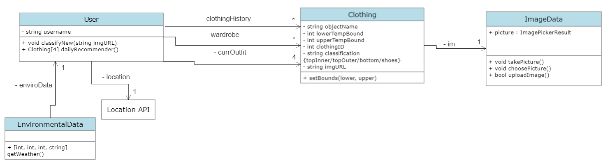

# Outfit-Forecast

An app to generate outfit predictions based on one's wardrobe and current weather.

Current class diagram

Test suite used: Jest (https://jestjs.io/)

Testing file: functions/frontend_functions_tests.js

How to compile: No need to compile!

How to run code:
- npm install (for dependencies)
- npx expo start

How to run the unit test cases:
- Since we are using React Native, we can no longer test functions using the traditional approach of having a test file and 
matching the observed output to the predicted one. Rather, we must check if the texts / images on the screen are aligned with what we expect to 
be displayed. Nonetheless, the testing file (app/functions/frontend_function_tests.js) was modified to include tests that can be run inside the
React functions we made 

Notes on testing:

 * sendSurveyResponses was incorporated into classifyNew(), so it is no longer a separate function
 * The output of getWeather changed. It no longer outpouts a JSON object, but an array. Additionally, this function relies on an API key that Lucas made for his account and is not displayed here for security reasons.
 * "dailyRecommender" no longer passes the user's wardrobe as an argument. Tyhe wardrobe info will be stored in the backend.
 * Furthermore, we changed how we are importing certain classes / functions because of React Native's syntax.

Implementation Description:
 * Inside /app, we can find the functions EnvironmentalData, PictureFunctions, User, and testing functions.
 * EnvironmentalData fetches the current weather.
 * PictureFunctions encompasses all functions related to image processing, such as taking a picture and choosing one from the gallery. 
 * User contains the getRecommender function, which sends a request to the backend for an outfit prediction based on sensitivity and the user's wardrobe.
 
Work Distribution:
* Lucas: EnvironmentalData class
* Luke Contreras: ImageData class
* Allie: UI Navigation and page layouts 
* Luke Knutson: UserCamera class

