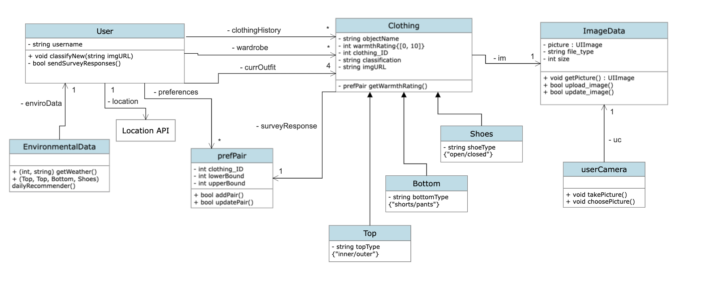

# Outfit-Forecast

An app to generate outfit predictions based on one's wardrobe and current weather.

Current class diagram

Test suites used:

- FRONT END: Jest (https://jestjs.io/)
- BACK END: unittest (https://docs.python.org/3/library/unittest.html)

Testing files:

- frontend_functions_tests.js -- for functions associated with the front end
- backend_functions_tests.py -- for functions associated with the back end
