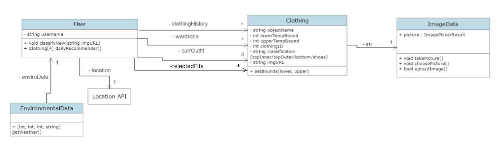

# Outfit-Forecast

An app to generate outfit predictions based on one's wardrobe and current weather.

Current class diagram

Testing file: testing/acceptance_tests.txt

How to run code:
- npm install (for dependencies)
- npx expo start

How to run the test cases:
- The majority of our testing is designed to be executed via acceptance testing. In the acceptance_tests.txt file, there are acceptance tests written for the features we have implemented in the frontend.

Notes on testing:

Code Directory Structure:
 * All of our code resides within /app. Within /app, App.js has the bulk of the code for navigation and overall app styling, and /functions contains the various components we have written to be displayed across the different pages.

Implementation Description:
 * EnvironmentalData fetches the current weather and renders the view on the Home screen.
 * ApiKeys.demo.js -- testing the frontend's integration with Firebase (for image storage)
 * PictureFunctions encompasses all functions related to image processing, such as taking a picture and choosing one from the gallery. 
 * User contains the getRecommender function, which sends a request to the backend for an outfit prediction based on sensitivity and the user's wardrobe.
 * tempRanges provides the functionality for the user to set a temperature range in which they are comfortable wearing the item of clothing from their wardrobe.
 * wardrobeGallery provides a view of all the items of clothing in a user's wardrobe, through a gallery format with image thumbnails. 

Milestone 4.A:

For the second iteration, the main functionality we plan on implementing encompasses having a more comprehensive navigation UI that enables a user to navigate throughout the main functionality of the app (seeing recommended outfit, adding temp preferences for wardrobe, and uploading new clothes to the wardrobe). Within this, we will continue to refine the functionality, namely by building out the functionality to add temperature preferences for clothing, provide a view to see the clothing items of the user, and have functionality for a user to request and decline an outfit. To build off of functionality implemented in the first iteration, we will also restructure our functions to output views which we can render on the various screens of our app.
For this milestone, what we originally had planned which we are no longer planning on implementing are adding logo and artwork, and when a user declines an outfit, recommending it less in the future. 
 
Work Distribution for 4.A:
* Lucas: EnvironmentalData and User functions
* Luke Contreras: uploadPicture in PictureFunctions and Firebase testing
* Allie: general navigation, HTML + CSS, UI direction, wardrobeGallery
* Luke Knutson: tempRanges functionality
* Everyone: Writing acceptance testing for their functionality

